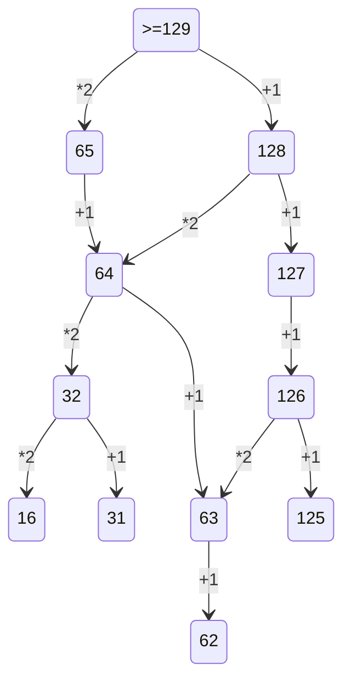

2. 1) Сгенерировать всевозможные сочетания переменных

   2) Проверить логическкую функцию на условие
   
   3) Сопоставить вывод с таблицей из задания

    print('x y z w')
    
    for x in range(2):
    
       for y in range(2):
       
          for z in range(2):
          
             for w in range(2):
             
                if (not(y<=x) or (z<=w) or not(z))==False:
                
                   print(x, y, z, w)
3. На все таблицы поставить фильтр
             
4. 1) Построить двоичное дерево дерево с известными данными
   
   2) Определить количество нужных для кодировки символов 
   
   3) Начать кодировку с минимальной длины кода. Посмотреть, хватает ли оставшийся вариантов, что закодировать остальное символы
   
   4) Если не хватает вариантов для кодирования оставшихся символов - увеличиваем длину кода
   
   
5. 1) Организовать цикл перебора с нуля до чила в условии ответа

   2) Перевод в двоичную СС (через bin() или f'{N:b}')
   
   3) Проверяем по условию и проводим манипуляции с числом
   
   4) Переводим в десятичную и проверяем на условия
    
 ```python  
    chislo=''
    num=(bin(i)[2:])   
    if num.count('1')%2==0:
        chislo='10'+num[2:]+'0'
    if num.count('1')%2!=0:    
        chislo='11'+num[2:]+'1'        
    if int(chislo,2)>40:    
        print (i, int(chislo,2))        
        break
```

6. 1) вспомнить команды turtle

   2) Нарисовать по алгоритму
   
   3) Поднять перо и нарисовать точки с учётом масштаба
   
   4) Посчитать вручную
   
8. 1)сгенерировать все возможные варианты чисел(for/product)

   2)проверить строчку на условия
   
   3)выводим счетчик значений
   
10. Открываем расширенный поиск в ворде и ставим галочки у позиций: учитывать регист и всё слово целиком

12. 
```python  
spisok=[]
for num in range(2,1000):
  n=0
  for delit in range (2,100):
    if num%delit==0 and x<i: n+=1
  
  if n==0:spisok.append(num)
        
flag=False
for i in spisok:
    for y in range (100):
        if y*4+117==i and flag==False:
            print(y, i)
            flag=True
```
13. Накопительно нумеруем вершины графа, потом суммируем или умножаем полученные значения 


14. 
```python
alph='0123456789abcde'
for x in alph:
    f=int(f'123{x}5',15)+int(f'1{x}233',15)
    if  f%14 ==0:
        print(f//14)
        break
```  
15. 
```python
for a in range(1, 1000):
   if all((x%2 == 0) <= (x%3 != 0) or (x + a >= 100) for x in range(1, 1000)):
      print(a)
      break
``` 
19, 20, 21 - 1) Определить точку входа (условие выигрыша, то сколько очков нужно набрать)

             2) Расписать двоичное дерево на четыре хода
             
             3) Ответить на вопрос задачи, присвоив ход игроку
             
             4) Расписывая таблицу на четыре хода, получаем решение всех трёх задач

23 - 1) С помощью функции product сформировать объект со всеми комбинациями искомой строки
     2) for prog in объект
     3) возвращаем стартовое значение в первоначальный вид (обнуляем его)
     4) используем continue для пропуска итераций неподходящих программ
     5) for x in prog - заходим в програму и анализируем команды
     6) проводим проверку на условия (if a == 7: break if a >= 35: break)
