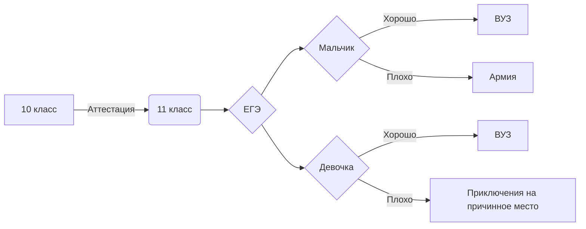

# Кукина Анна 122 А
[OpenProcessing](https://openprocessing.org/user/344112)

aakookie.github.io

https://codepen.io/Aakookie

https://aakookie.wordpress.com/
    
| Номер задачи ЕГЭ | Статус |
| ------ | ------ |
| 1 | 58 |
| 2 | + |
| 3 | + |
| 4 |  |
| 5 |  |
| 6 |  |
| 7 |  |
| 8 |  |
| 9 |  |
| 10 | 45 |
| 11 |  |
| 12 |  |
| 13 |  |
| 14 |  |
| 15 |  |
| 16 |  |
| 17 |  |
| 18 |  |
| 19 | 64 |
| 20 | 63/32 |
| 21 | 62 |

папка turt - рисованние фракталов в черепашке

папка md - три картинки, сгенерированные в midjourney

5_in_1.py - 5 в 1: морзе, СС (3), Хемминг

chemp.py - программа по ЧМ по футболу

names - программа-генератор имён

[db.py](db.py) - создание базы данных и работа с ней

flask_work.py - работа с модулем Flask

pyth.ipynb - кусочки кода на python, которые я умею писать 

sql_comands.md - sql запросы

solving_ege.md - описание решения задач егэ

victorina.py - викторина с английскими словами

Книга1.xlsx - работа с различными задачами в exel (таблица умножения, перевод сс, работа с формулами расчёта объёма данных)

Нейросимулятор.png - обучение нейросети квадраным уравнениям

Булева алгебра.xlsx - реализация выражений алгебры-логики

возведение числа в степень.py - код, возводящий указанное число в указанную степень

диаграмма_кодирование10.png - краткая схема файла кодирование10.py

из 10 в 3.xlsx - перевод числа из десятичной сс в троичную сс

кодирование10 - универсальный решатель 

морзе.xlsx - перевод слова в азбуку Морзе 

перевод + таблица.xlsx - перевод из десятичной сс в любую другую + таблица умножения в какой-либо сс

слайды.py - работа с видео и изображениями в python

20 Закон алгебры логики:

$$ A \Delta B = \left( \bar A \wedge  B \right) \vee \left( A \wedge \bar B \right) $$

$\overline{E}^2_{0} = \sqrt \frac{{Fa^2_{0}}}{(x-1)\cdot{x}} + \alpha^2_{1} + \beta^2_{1}$

